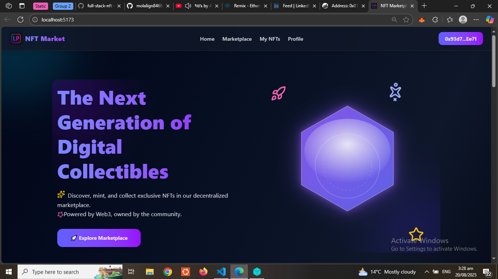
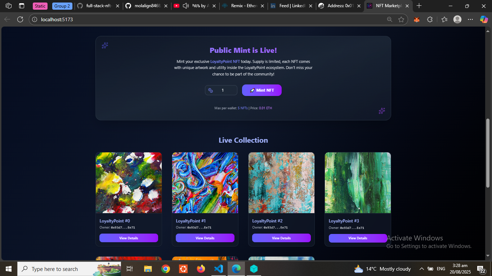
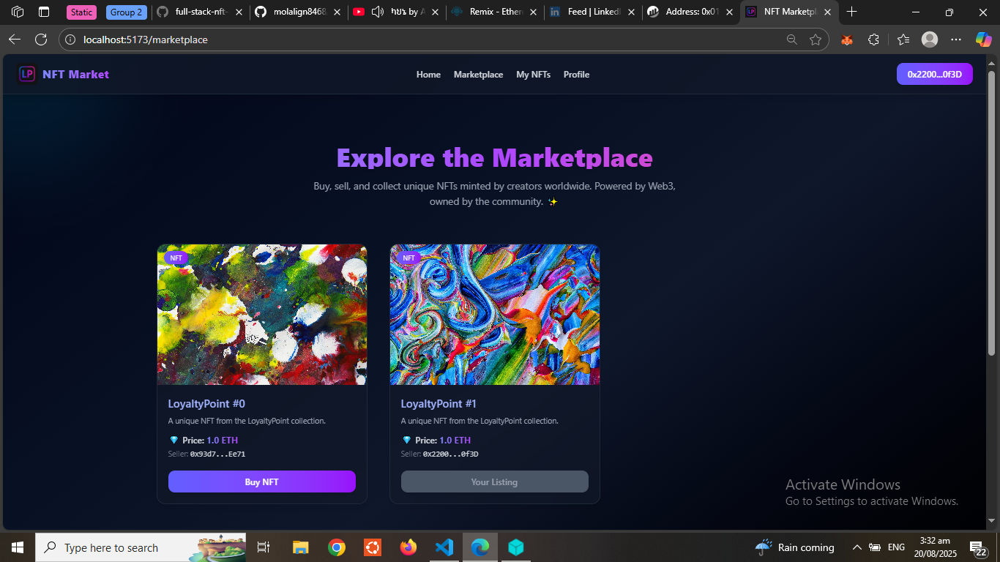

# 🖼️ NFT Marketplace dApp | ERC-721 + IPFS (Pinata) + Hardhat


A full-stack **Web3 decentralized application** that allows users to **mint, buy, and sell NFTs** securely on the Ethereum **Holesky Testnet**.  
NFT metadata and assets are stored on **IPFS via Pinata**, ensuring decentralized and permanent availability.  
This project demonstrates **end-to-end NFT lifecycle management** — from minting to trading — using **Solidity smart contracts, Hardhat, and React (Vite)**.

## 🎥 Live Preview

🔗 **Live Demo:** [https://loyaltynftio.vercel.app/](https://loyaltynftio.vercel.app/)

Hero Section Preview:  


Minted NFT Preview:  


Marketplace Preview:  


🔗 **Marketplace Deployed Contract (Holesky):** [Etherscan Link](https://holesky.etherscan.io/address/0x1da9C613Db3383785bCd5bf22df46b55219dA36D)

🔗 **NFTCollection Deployed Contract (Holesky):** [Etherscan Link](https://holesky.etherscan.io/address/0x01B468456F3a17E024a0e02e5ac481953d487445)

📂 **Pinned Metadata on IPFS (Pinata):** [`/nft-meta-data`](./nft-meta-data)

---

## 📌 Project Overview

This NFT marketplace is built for showcasing **Web3 skills in smart contracts, decentralized storage, and frontend integration**.  
Users can mint NFTs, list them for sale, and purchase from others in a **trustless environment**, while an **admin dashboard** provides contract-level control.

---

## 🚀 Core Features

- **🎨 Minting:** Users mint NFTs with metadata + assets stored on **IPFS (Pinata)**.
- **🛒 Marketplace:** Browse, buy, and sell NFTs through a secure on-chain marketplace contract.
- **👤 User Gallery:** Personalized dashboard where users can view, manage, and list their NFTs.
- **🔑 Admin Controls:** Owner-only access to toggle mint state, manage sales, and withdraw funds.
- **✅ Fully Tested:** Smart contracts tested using **Hardhat test suite** (`MyNFT.test.js`, `Marketplace.js`).
- **🌍 Deployed on Holesky Testnet:** Verified contracts on [Holesky Etherscan](https://holesky.etherscan.io/address/0x1da9C613Db3383785bCd5bf22df46b55219dA36D).

---

## 🛠️ Technology Stack

- **Frontend:** React (Vite), Ethers.js, Zustand, React Router, Tailwind CSS, React Toastify
- **Smart Contracts:** Solidity, OpenZeppelin, Hardhat (with Ignition for deployment)
- **Web3 & Storage:** Ethereum (Holesky), MetaMask, **IPFS (Pinata)**
- **Testing:** Hardhat Chai + Mocha test framework

---

## 📜 Smart Contract Functionality

### **NFT Collection (ERC-721)**

- `Mint` → Mint new NFTs with IPFS metadata when sales open.
- `flipSaleState` → Enable/disable public minting.
- `withdraw` → Withdraw funds (owner-only).

### **Marketplace Contract**

- `listItem` → List an NFT for sale.
- `buyItem` → Securely purchase listed NFTs.
- `cancelListing` → Cancel active listings.

---

## 📂 Folder Structure

```bash
nft-marketplace/
│── contracts/                  # Solidity smart contracts
│── ignition/                   # Hardhat Ignition deployment modules
│── nft-meta-data/              # Pinned NFT metadata JSON files (Pinata/IPFS)
│── nft-marketplace-frontend/   # Frontend app (React + Vite)
    │── public/                     # Public assets
    │── src/
    │   ├── assets/                 # Images, logos, static files
        │   ├── components/             # Reusable UI components
    │   ├── contracts/        # Contract ABIs & addresses
    │   ├── pages/                  # Main application pages
    │   ├── store/
    │   │   └── blockchainStore.jsx # Zustand Web3 state & contract logic
    │   ├── App.jsx
    │   ├── index.css
    │   └── main.jsx
│── test/                       # Hardhat test files
│   ├── Marketplace.js
│   └── MyNFT.test.js
│── hardhat.config.js
│── vite.config.js
│── package.json
│── README.md
```

## ⚡ Getting Started

### **Prerequisites**

- Node.js (>=16.x)
- npm
- **MetaMask or Web3 wallet** (must be installed & connected)
- **Holesky ETH** testnet tokens (required to interact with the live demo)
- Pinata account for IPFS

👉 To use the **live deployed dApp**, you must:

1. Connect your Web3 wallet (MetaMask).
2. Switch network to **Ethereum Holesky Testnet**.
3. Have a small balance of **Holesky ETH** (free from testnet faucets).

### ⚙️ Installation for Local Development

Clone the repository:

```bash
git clone https://github.com/molalign8468/full-stack-nft-marketplace.git
cd full-stack-nft-marketplace
```

---

#### **1. Smart Contracts (Hardhat)**

install dependencies:

```bash
npm install
```

Run tests to ensure everything works:

```bash
npx hardhat test
```

Deploy contracts to Holesky (or local Hardhat node):

```bash
npx hardhat ignition deploy ./ignition/modules/ --network holesky
```

---

#### **2. Frontend (React + Vite)**

In a new terminal, navigate to the frontend folder:

```bash
cd ../nft-marketplace-frontend
npm install
```

Start the development server:

```bash
npm run dev
```

Visit [http://localhost:5173](http://localhost:5173) in your browser.

## 🌐 IPFS Integration (Pinata)

- All **NFT metadata and images** are pinned using Pinata (`/nft-meta-data`).
- Metadata follows the ERC-721 JSON standard:

```json
{
  "name": "NFT #1",
  "description": "Exclusive collectible on Holesky Testnet",
  "image": "ipfs://QmYourImageCID",
  "attributes": [
    { "trait_type": "Background", "value": "Blue" },
    { "trait_type": "Power", "value": "100" }
  ]
}
```

---

## 🔧 Deployment Notes

- Contracts deployed with **Hardhat Ignition** to Holesky.
- Update `src/contracts/config.jsx` with deployed contract addresses + ABIs.
- Marketplace + NFT contracts are **verified on Holesky Etherscan**.

---

## 🔍 SEO Keywords

NFT Marketplace · Web3 dApp · ERC-721 · Solidity · Hardhat · IPFS Pinata · Ethereum Holesky Testnet · NFT Minting · NFT Trading · Decentralized Marketplace

---

## 🤝 Contributing

Contributions, issues, and feature requests are welcome!
Please fork the repo and submit a pull request.

---

## 📄 License

MIT License © 2025 Molalign
Free to use, modify, and distribute with attribution.
